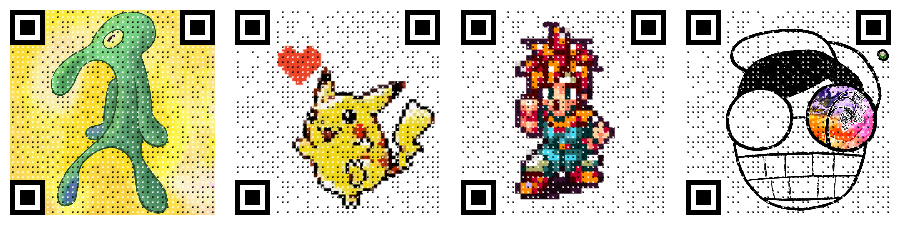

# QRImage

    QRImage is a web app to generate QR codes with images.

    

### Usage

1. Open [site](https://hughchen.github.io/qr_image/).
2. Upload an image.
3. Enter the URL.
4. Adjust parameters.
5. Download `PNG`.

## Dependency

* [davidshimjs / qrcode](https://github.com/davidshimjs/qrcodejs)

## License

[GPLv3](LICENSE)
